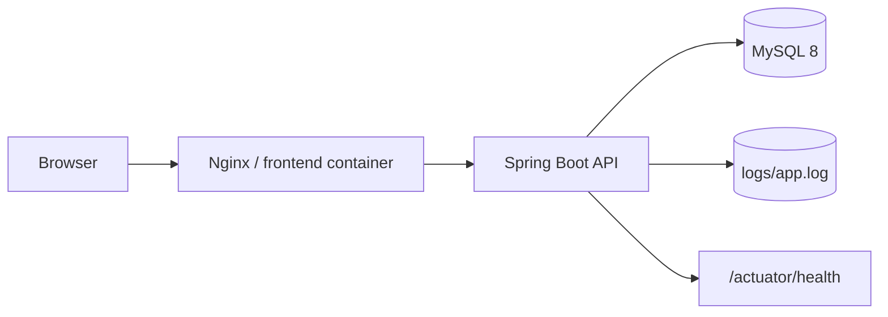
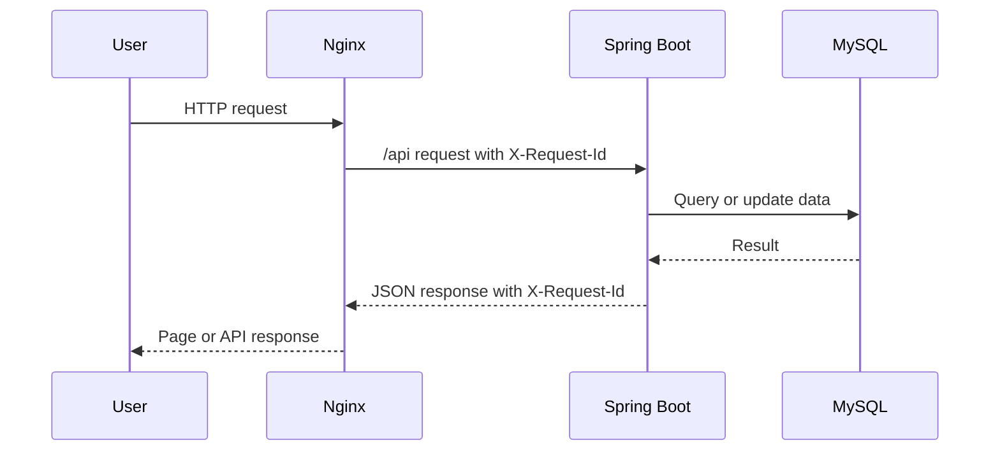
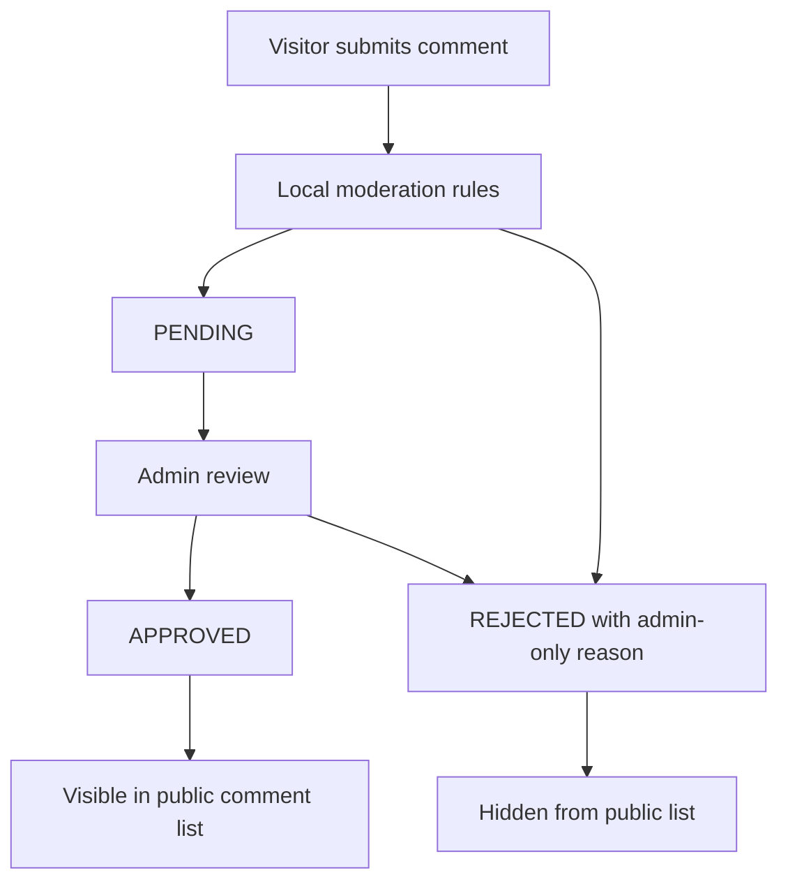

# Architecture

## Overview

`sudo-make-me-a-website` is a self-hosted personal blog system. The frontend is
a Vue/Vite single page app served by Nginx in production. The backend is a
Spring Boot REST API backed by MySQL. API documentation is generated with
OpenAPI, and production operations rely on Actuator health checks, request ids,
and rolling logs.

## Backend Modules

- Auth: admin login, bearer token validation, and first-admin bootstrap.
- Post: public post listing/detail and admin post create/update/delete.
- Comment: visitor submission, public approved comments, admin moderation.
- Moderation: local anti-spam checks for links and blocked keywords.
- Media: image upload, listing, redirect, and deletion.
- Maintenance: maintenance mode status and admin updates.
- Config: site, sidebar, social, categories, collections, and browser icons.
- Infrastructure: security policy, request id filter, exception handling,
  OpenAPI config, Actuator, and logging.

## Frontend Modules

- Public pages: home, category, collection, post, search, maintenance, and
  not-found views.
- Admin pages: login, posts, comments, categories, collections, media, social,
  sidebar, and maintenance settings.
- API client: typed request wrappers and shared error parsing.
- Stores: authentication state and token validation.
- Utils: date formatting, API error parsing, feedback, and content helpers.
- Types: frontend DTO contracts aligned with backend responses.

## Request Flow

## Comment Moderation Flow

Visitor comments default to `PENDING` unless a local anti-spam rule rejects
them. Public comment APIs return only `APPROVED` comments. `moderationReason`
is available only in admin moderation responses.

## Operations Flow

- Every request receives or reuses `X-Request-Id`.
- The backend puts the request id into MDC so application logs can be searched
  by the same value.
- Production logs are written to `logs/app.log` with rolling retention.
- `/actuator/health` is exposed for health checks.
- Docker logs remain useful for container-level troubleshooting.

## Deployment View

Docker Compose defines three primary services:

- `mysql`: MySQL 8 with persistent volume.
- `backend`: Spring Boot application running the `prod` profile.
- `frontend`: Nginx serving the Vue build and proxying `/api` to the backend.

## Database Migration Strategy

- New production database: execute `docs/migrations/bootstrap-schema.sql`.
- Existing production database: execute numbered migrations such as `001-*` and
  `002-*` in order.
- Production uses `spring.jpa.hibernate.ddl-auto=validate`.
- Production uses `spring.sql.init.mode=never`.
- Containers do not run migrations automatically.

## Security Boundaries

- No public default admin password.
- Admin bootstrap is controlled by environment variables and should be removed
  after first use.
- Production Swagger UI and OpenAPI JSON are disabled by default.
- Production exposes only the Actuator health endpoint by default.
- `.env`, logs, and backups are ignored by Git.
- Comment anti-spam rules are local; comments are not sent to external
  moderation services.
